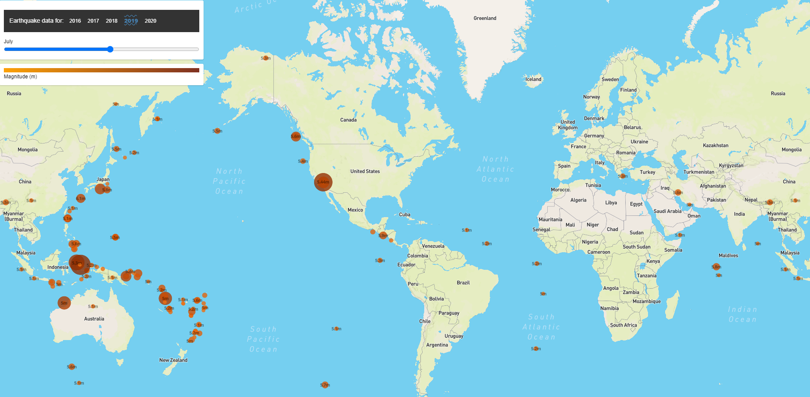

# Visualizing Data with Leaflet

## Background

The USGS is responsible for providing scientific data about natural hazards, the health of our ecosystems and environment; and the impacts of climate and land-use change. Their scientists develop new methods and tools to supply timely, relevant, and useful information about the Earth and its processes.

The USGS is interested in building a new set of tools that will allow them visualize their earthquake data. They collect a massive amount of data from all over the world each day, but they lack a meaningful way of displaying it. Their hope is that being able to visualize their data will allow them to better educate the public and other government organizations (and hopefully secure more funding..) on issues facing our planet.

## Requirements

### Basic Visualization

Visualize an earthquake data set similar to the provided sample above.

1. **Get your data set**

   

   The USGS provides earthquake data in a number of different formats, updated every 5 minutes. Pull the required JSON data from the [USGS GeoJSON Feed](http://earthquake.usgs.gov/earthquakes/feed/v1.0/geojson.php) page.

Sample Data
   

2. **Import & Visualize the Data**

   Create a map using Leaflet that plots all of the earthquakes from the data set based on their longitude and latitude.

### Considerations

   * Data markers should reflect the magnitude of the earthquake by their size and and depth of the earth quake by color. Earthquakes with higher magnitudes should appear larger and earthquakes with greater depth should appear darker in color.

   * Create a legend that will provide context for the map data.

   * Only 2 years of data required - but more data is better as long as the load times are not heavily impacted. 

   ### Screenshot

